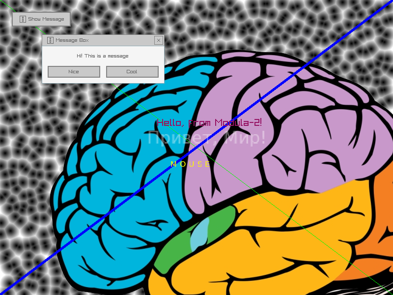

# m2-raylib
Modula-2 bindings for [raylib](http://www.raylib.com/), a simple and easy-to-use library to enjoy videogames programming.

This is a low-level, *thin* bindings, i.e. the module definition just directly maps C API to Modula-2, with all of the names
and meanings intact.

# Status
This project is a **work-in-progress**.
Currently, all of the Raylib public functions and datastructures are (somehow) interfaced, with numerical constants (enums) underway.
Some pointer/array arguments of the C functions are passed as `SYSTEM.ADDRESS` for now. Patches are welcomed.

# Versions
The library version used in making of the bindings is `raylib-5.1-dev`. 
Tested with `GNU Modula-2 (12.2.0)`.

# TODO
- bind enumerations and other non-procedure stuff
- decide how to really interface functions with complex arrays/pointers arguments
- check bound datatypes' integrity on/after calling the C API
- excessive testing

# Usage
Compile with something like:
``` sh
gm2 -fiso -o Driver1 Driver1.mod libraylib.so
```
Please see `Makefile` for my attempt at a more general workflow.

# Sample code
Functions, data, etc. are bound one-to-one (the [Raylib cheatsheet](https://www.raylib.com/cheatsheet/raylib_cheatsheet_v4.5.pdf) helps). This is what client code can look like:

``` modula-2
MODULE Driver1;

FROM raylib IMPORT InitWindow, BeginDrawing, ...; (* import needed stuff *)

CONST
   imgPath = "/home/nbrk/brain.png";
VAR
   pos : Vector2;
   img : Image;
   texImg, texFile : Texture2D;
BEGIN
   InitWindow(800, 600, "Modula-2 + Raylib");

   img := GenImageCellular(800, 600, 20);
   texImg := LoadTextureFromImage(img);
   UnloadImage(img);
   img := LoadImage(imgPath);
   texFile := LoadTextureFromImage(img);
   UnloadImage(img);

   ToggleFullscreen;

   LOOP
      BeginDrawing;
      ClearBackground(Color{0,0,0, 0});
        pos := GetMousePosition();
        DrawTexture(texImg, 0, 0, Color{255,255,255,255});
        DrawTexture(texFile, 100, 100, Color{255,255,255,255});
        DrawLine(0, 0, GetScreenWidth(), GetScreenHeight(), Color{0, 255, 0, 255});
        DrawLineEx(Vector2{800.0, 0.0}, Vector2{0.0, 600.0}, 5.0, Color{0, 0, 255, 255});
        DrawText("Hello, from Modula-2!", 320, 240, 20, Color{150, 20, 100,255});
        DrawText("MOUSE", INT(pos.x), INT(pos.y), 14, Color{255,0,0,255});
      EndDrawing;

      IF WindowShouldClose OR IsKeyPressed(256) THEN
         EXIT;
      END;

      WaitTime(1.0 / 60.0);
   END (* loop *);

END Driver1.
```

# Screenshot

